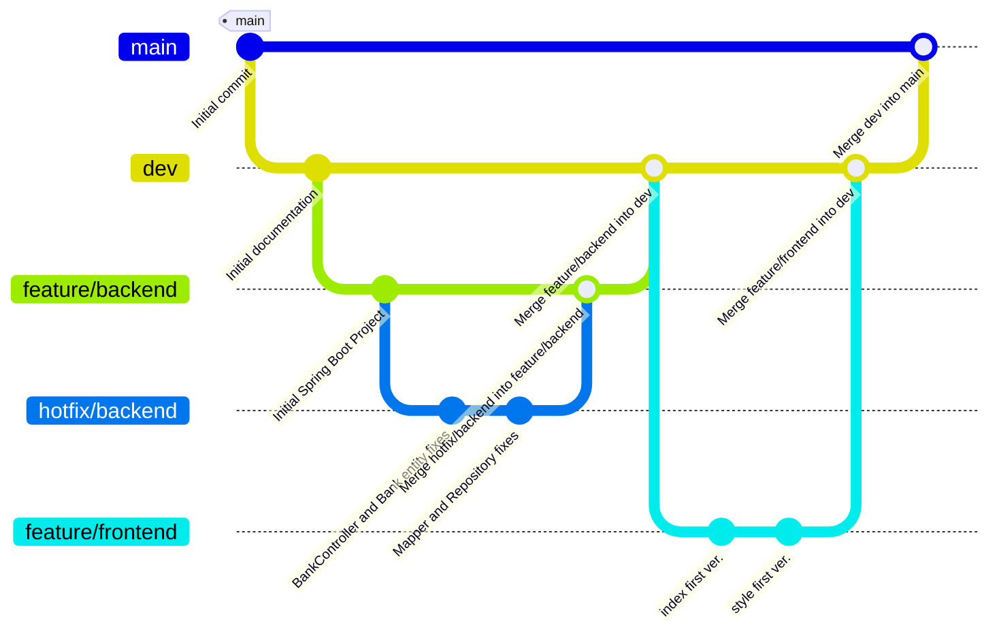

# RKD
Development Documentation

# Spring Boot Application

Цей проєкт є базовою структурою для створення сучасного застосунку з використанням фреймворку **Spring Boot**.

## 🔧 Можливості

- Модульна архітектура
- Гнучка конфігурація
- Підтримка REST API
- Інтеграція зі сторонніми сервісами
- Розширюваність під потреби проєкту

## 🚀 Запуск проєкту

1. Клонуйте репозиторій:
   ```bash
   git clone https://github.com/Sviatozar/RKD

## 📦 Збірка
Для збірки використовуйте:

   ./mvnw clean package

## 📄 Ліцензія
Цей проєкт розповсюджується під відкритою ліцензією. Умови використання див. у файлі LICENSE

## 📁 Структура проєкту
src   
├── main    
│   ├── java   
│   └── resources       
└── test 


## Change Log

Front: було розроблено дві версії інтерфейсу для додатку
також було підібрано  сучасний та гарний стиль

Back: Розроблено багатошаровий Spring Boot проєкт,
що включає контролери, сервіри, репозиторії для роботи з базою даних.

## Історія комітів


