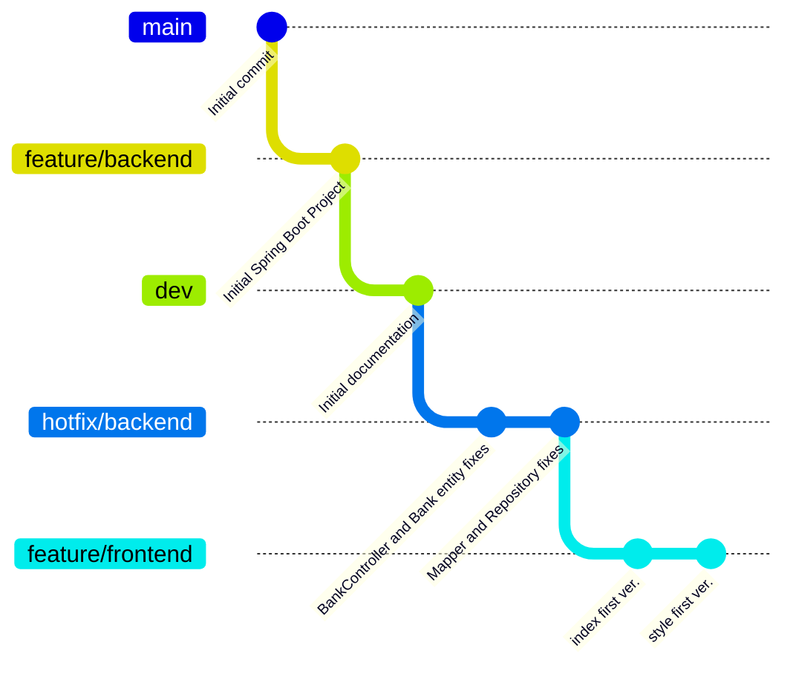

# RKD
Development Documentation

# Spring Boot Application

Цей проєкт є базовою структурою для створення сучасного застосунку з використанням фреймворку **Spring Boot**.

## 🔧 Можливості

- Модульна архітектура
- Гнучка конфігурація
- Підтримка REST API
- Інтеграція зі сторонніми сервісами
- Розширюваність під потреби проєкту

## Change Log

